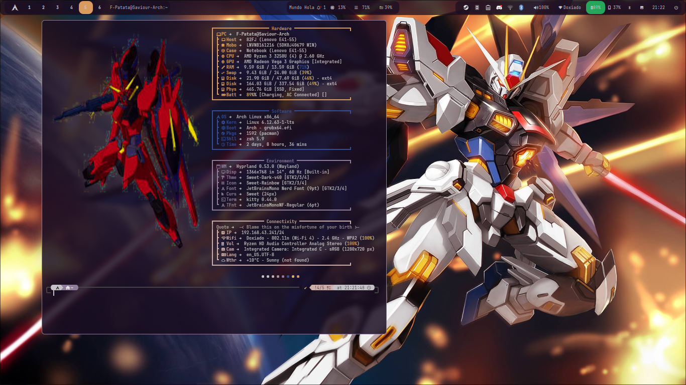

# 🍙 Patata's Dotfiles (Hyprland Rice)




This repository hosts my complete personal configuration for a **Hyprland** desktop environment on **Arch Linux**.

Recently migrated from the traditional Waybar/Rofi stack to the **Noctalia Shell** (based on Quickshell), this setup aims for a seamless, unified UI experience. It is optimized specifically for efficiency on modest hardware, squeezing every drop of performance out of a Ryzen mobile APU while maintaining a visually stunning aesthetic.

Everything is managed via [GNU Stow](https://www.gnu.org/software/stow/) and includes a master installation script for rapid deployment.

---

## 🎬 Workflow in Action

*Featuring the Noctalia launcher, fluid animations, and real-time blurring.*


---

## ✨ Key Features

- **Noctalia Shell Ecosystem**: A unified interface handling the Status Bar, App Launcher, Notification Center, and OSDs. No more mismatched configs between Waybar, Dunst, and Rofi.
- **Dynamic Theming**: The entire system (Shell, Terminal, GTK) adapts to your wallpaper using `pywal` and internal IPC hooks.
- **Performance Optimized**:
  - tuned `tlp` configuration for the Ryzen 3250U (Aggressive battery saving on Vega 3, Max performance on NVMe).
  - `zRAM` configured (Half of physical RAM) to prevent paging to disk.
  - **LVM Layout**: Logical volumes for `/`, `/home`, and `swap` for maximum flexibility.
- **Hardware Specifics**:
  - **Fingerprint Support**: Pre-configured PAM and drivers for Goodix 27c6:55b4 sensors.
  - **SSD Optimization**: Specific rules to prevent PCIe power-saving glitches on WD Black SN750 drives.
- **Automated Install**: A master `install.sh` script handles packages, services, fonts, and dotfile linking.

## 🚀 Installation

> **Warning:** This setup is tailored for the **Lenovo E41-55**. While the configs are modular, the install script assumes an Arch base. Use at your own risk.

**Prerequisites:** A base Arch Linux install with `git`, `sudo`, and an active internet connection.

1.  **Clone the Repository**
    ```bash
    git clone https://github.com/F-Patata2008/DotFiles-New.git ~/Dotfiles
    cd ~/Dotfiles
    ```

2.  **Run the Master Installer**
    The script handles dependencies (Pacman/AUR), drivers, and symlinks.
    ```bash
    cd Install
    chmod +x install.sh
    ./install.sh
    ```

3.  **Reboot**
    Essential for services, udev rules, and the shell to initialize correctly.
    ```bash
    reboot
    ```

## 🛠️ Software Stack

| Component | Application | Description |
| :--- | :--- | :--- |
| **Window Manager** | `Hyprland` | The core compositor. |
| **Shell / UI** | `Noctalia` | **NEW:** Handles Bar, Launcher, Control Center & Notifications. |
| **Terminal** | `Kitty` | GPU accelerated, running `zsh` + `p10k`. |
| **Editor** | `Neovim` | Custom Lua config for development. |
| **Browser** | `Zen Browser` | Privacy-focused Firefox fork. |
| **File Manager** | `Thunar` / `Yazi` | GUI and CLI options (Instant startup). |
| **Lock Screen** | `hyprlock` | Integrated with `hypridle` for battery savings. |
| **Power Mgmt** | `tlp` | Aggressive tuning for Vega 3 graphics. |
| **Secrets** | `gnome-keyring` | For seamless SSH/GPG handling. |
| **Dotfile Mgmt** | `GNU Stow` | Symlink management. |

## 💻 The Machine (Lenovo E41-55)

This rice proves you don't need a $3000 ThinkPad to have a top-tier experience.

- **CPU:** AMD Ryzen 3 3250U (Zen)
- **GPU:** AMD Radeon Vega 3 (Integrated)
- **RAM:** 16 GB DDR4 2400MHz
- **Storage:** 500 GB WD Black SN750 NVMe (PCIe 3.0)
- **Biometrics:** Goodix Fingerprint Reader

---
*Crafted in Arch (BTW).*
