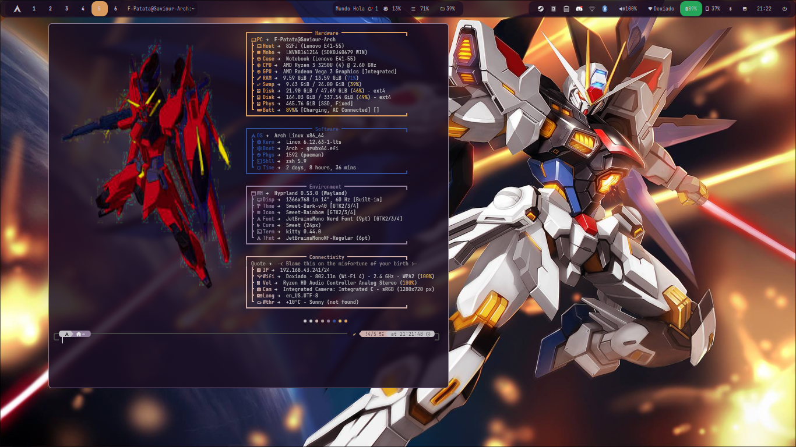

# 🍙 Patata's Dotfiles (Hyprland Rice)

<div align="center">


<br/>



*A modular, high-efficiency Hyprland workstation rice featuring Noctalia Shell, dynamic pywal theming, and multi-distro deployment across **Fedora 44 Workstation** and **Arch Linux**.*

</div>

---

## 🎬 Workflow in Action

*Featuring the Noctalia launcher, fluid animations, dynamic blur, and instant shell reactivity.*


---

## ✨ Key Highlights

- **Unified Noctalia Shell**: Consolidates status bar, application launcher, control center dashboard, notifications, and on-screen displays (OSDs) into a single reactive interface.
- **Dynamic Theming Engine**: Wallpapers drive system-wide palette generation via `pywal` and Noctalia IPC templates across Kitty, GTK, and Hyprland borders.
- **Multi-Distro Modular Deployment**:
  - **Fedora 44 Workstation**: Native DNF5/DNF integration, Flatpaks, Copr repos (`clipse`, `libfprint-goodixtls`, `Hyprland`, `PyCharm`, `zen-browser`).
  - **Arch Linux**: Pacman and AUR manifests, multilib, and custom PAM authentication rules.
  - **Termux (Android)**: Headless CLI deployment profile for mobile productivity.
- **Hardware-Tuned Performance**:
  - **Distro-Aware Power**: Preserves native `power-profiles-daemon` / tuned on Fedora, while applying aggressive `tlp` tuning for the Vega 3 GPU on Arch.
  - **Zero-Fork Shell Startup**: Instant Zsh launch powered by Powerlevel10k and deduplicated environment paths.
  - **zRAM with `zstd`**: High-ratio memory compression with `vm.page-cluster = 0` to eliminate swap latency spikes on memory-constrained APUs.
- **Hardware Sovereignty & Biometrics**:
  - **Goodix Fingerprint**: Automated PAM and USB power-saving udev rules for the Goodix `27c6:55b4` sensor.
  - **Battery Hibernation Watchdog**: `check-bat` systemd watchdog initiates hibernation automatically at $\le 5\%$ battery.
  - **Arch SN750 Custom Boot Profile**: Fully isolated boot configuration for LUKS full-disk encryption, LVM virtual partitions (`root`, `home`, `swap`), custom Minegrub GRUB theme, and Minecraft Plymouth bootsplash.

---

## 📁 Repository Architecture

Each user-facing configuration is a self-contained **GNU Stow package** mirroring `$HOME`:

```text
Dotfiles/
├── fastfetch/                   # Fastfetch with custom Hatsune Miku banner
├── hypr/                        # Hyprland Lua configuration & helper scripts
│   └── .config/hypr/
│       ├── conf/                # Modular Lua configs (binds, startup, animations, etc.)
│       └── scripts/             # polkit.sh (dynamic agent), update.sh, screenshot.sh
├── kitty/                       # Kitty terminal configuration & pywal integration
├── nvim/                        # Neovim IDE setup (Lazy.nvim, LSP, Treesitter)
├── ohmyzsh/                     # Oh-My-Zsh git submodule
├── zsh/                         # Zsh configuration, aliases, and p10k prompt
├── Wallpapers/                  # Rice wallpapers collection
└── Install/                     # Multi-distro deployment & backup toolbox
    ├── install.sh               # 🚀 Universal master installer
    ├── bakup.sh                 # 🛡️ Profile-safe reverse sync from / to repo
    ├── update_packages.sh       # 📦 Distro-aware package synchronizer
    └── profiles/
        ├── distros/             # Fedora & Arch package manifests
        └── machines/            # Lenovo E41-55, Arch SN750 boot, Generic PC
```

---

## 💾 Multi-Boot Drive Topology

This repository is configured to seamlessly maintain and switch between two distinct boot environments on the same laptop hardware:

| Drive | Device | Operating System | Storage Layout | Power / Boot Management |
| :--- | :--- | :--- | :--- | :--- |
| **Drive 1** | 256GB Samsung NVMe | **Fedora 44 Workstation** | Btrfs on LUKS (`/`, `/home`) | Native `power-profiles-daemon` & tuned |
| **Drive 2** | 500GB WD Black SN750 | **Arch Linux** | LVM on LUKS (`Patata-root`, `home`, `swap`) | Custom GRUB (`minegrub`), Plymouth (`mc`), TLP |

---

## 🚀 Installation & Deployment

### 1. Clone the Repository
```bash
git clone --recurse-submodules https://github.com/F-Patata2008/DotFiles-New.git ~/Dotfiles
cd ~/Dotfiles
```

### 2. Run the Universal Installer
The interactive installer automatically detects your active operating system, checks for laptop hardware specifics, and prompts for your desired profile:
```bash
cd Install
./install.sh
```

### 3. Termux (Android Tablet / Phone)
For minimal CLI deployment on Android via Termux:
```bash
cd Install
./install-termux.sh
```

---

## 🛠️ Software Stack

| Component | Application | Description |
| :--- | :--- | :--- |
| **Window Manager** | `Hyprland` | Wayland dynamic tiling compositor configured in Lua. |
| **Desktop Shell** | `Noctalia Shell` | Unified Quickshell-based bar, launcher, dashboard & OSDs. |
| **Terminal** | `Kitty` | GPU-accelerated terminal running `zsh` + `powerlevel10k`. |
| **Editor** | `Neovim` | Full-featured modular Lua IDE with Lazy.nvim. |
| **Browser** | `Zen Browser` | Privacy-focused, customizable Firefox fork. |
| **File Manager** | `Nautilus` / `Yazi` | GUI and lightning-fast terminal file management. |
| **Privilege Escalation**| `polkit.sh` | Dynamic Polkit agent detector across Fedora & Arch. |
| **Power Management**| `power-profiles-daemon` / `tlp` | Native Fedora power profiles or aggressive Arch Vega tuning. |
| **Clipboard** | `clipse` | TUI clipboard manager integrated into Wayland binds. |
| **Dotfile Symlinks**| `GNU Stow` | Clean symlink management for all `$HOME` configurations. |

---

## 💻 Hardware Specifications (Lenovo E41-55)

The **Saviour Gundam** mobile workstation:

- **CPU**: AMD Ryzen 3 3250U (Zen+ 14nm, 2 Cores / 4 Threads @ 3.5GHz Boost)
- **GPU**: AMD Radeon Vega 3 Graphics (Shared VRAM, Raven2 VCN hardware decoding)
- **Memory**: 16 GB DDR4 @ 2400MHz
- **Primary OS Storage**: 256 GB Samsung PCIe 3.0 NVMe SSD (Fedora 44 Workstation)
- **Secondary OS Storage**: 500 GB WD Black SN750 NVMe SSD (Arch Linux Custom Boot)
- **Biometrics**: Goodix 27c6:55b4 Fingerprint Reader
- **Peripherals**: Logitech G502 Lightspeed (1000Hz polling, stealth mode)

---

## 🔄 Maintenance & Synchronization

- **Sync Live Changes**: Run `./Install/bakup.sh` to safely copy tracked `/etc` configurations into your active distro/machine profile without cross-distro corruption.
- **Export Packages**: Run `./Install/update_packages.sh` to update package manifests (`dnf-all.txt`, Copr, Flatpaks on Fedora; `pacman-all.txt`, AUR on Arch).
- **Auto Commit & Push**: Run `./push.sh` to stage, commit, and push updates to `origin main`.

---

<div align="center">

*Engineered with revolutionary precision for maximum efficiency on proletarian hardware.* 🍙

</div>
