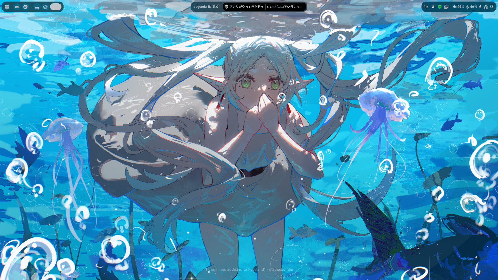
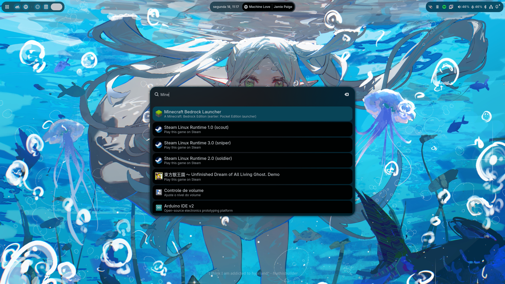
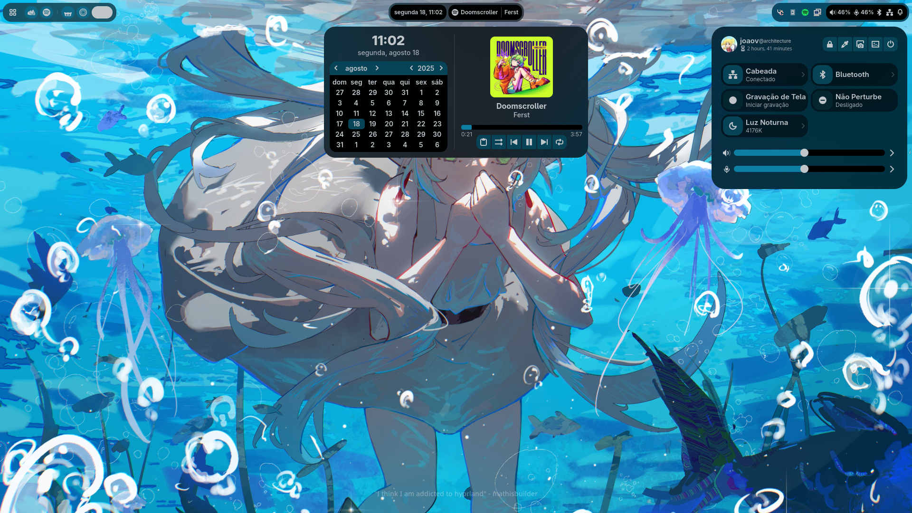
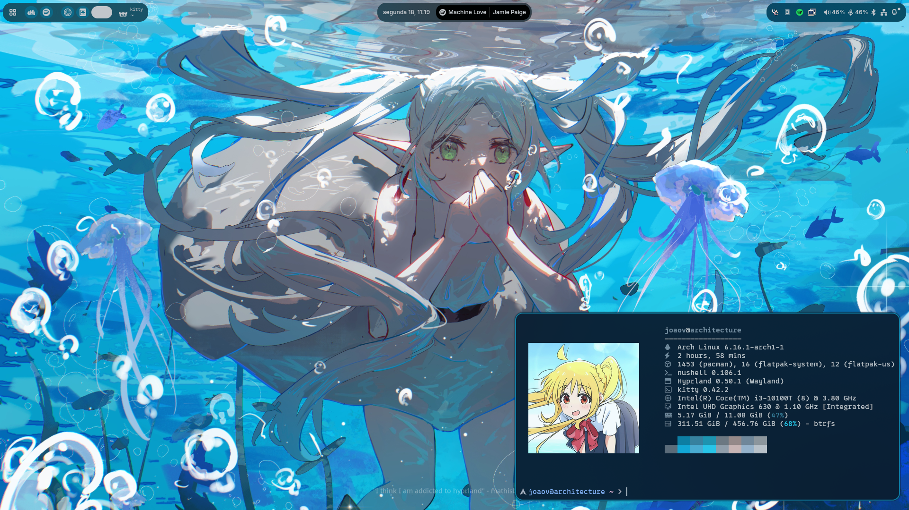

# colorshell

> [!note]
> My personal dotfiles are now on [retrozinndev/Hyprland-Dots](https://github.com/retrozinndev/Hyprland-Dots)

This is the repository for the colorshell desktop shell, made for Hyprland with [TypeScript], [GTK4], [AGS], [Gnim], and some of the [Astal] libraries.

It really took me a lot of time to make this, so please star the repo if you like it! :star:

## 🌄 Screenshots
<div align="center">
  
  
  
  

  <p align="right">
    <i>more screenshots on <a href="repo/shots"><code>repo/shots</code></a></i>
  </p>
</div>

## 🎨 Colors
All the shell colors are dynamically generated from your wallpaper! 

This is possible by using [pywal16], a fork of the archived [pywal](https://github.com/dylanaraps/pywal) project. 
It's a cli tool to generate color schemes from an image.

## 🖼️ Wallpapers
These are not included in the shell anymore, because the repository was getting too big in size. 
So you'll have to add it in your own.

You can add more wallpapers either by adding your custom images to `~/wallpapers` or by defining `WALLPAPERS` 
in your `hypr/user/environment`, pointing to the custom location.

Also, you can select any of the images inside `~/wallpapers` by pressing 
<kbd>SUPER</kbd> + <kbd>W</kbd> or by accessing the Control Center and clicking in the image 
icon on top.

## ✨ Features
<details>
  
- Pretty Top-Bar
  - Apps(basically the "start menu", opens the full-screen app launcher)
  - Workspaces indicator
  - Focused Client(window) information(title, class and icon)
  - Clock(with date)
  - Media
    - Change current player by scrolling on top of the widget or by opening the
Center Window and scrolling the player
    - Only available when there's media playing
  - Tray(Applications running in the background)
  - Status (volume information, bluetooth, network and notification status)
- Control Center
  - Sliders 
    - Speaker volume
    - Microphone sensitivity
    - Brightness amount
  - Pages(the thing that shows up when you click the arrow on a tile)
    - Bluetooth devices
    - Network devices
    - Night Light controls
    - Brightness options
  - Tiles
    - Screen Recording
    - Bluetooth
    - Night Light
    - Network(wifi needs work, i don't have wifi in my machine)
    - Don't Disturb(disables notification popups)
- Center Window(clock, calendar + media management)
- OSD (On-screen Display)
  - Brightness(when changed)
  - Volume(when changed)
- Notifications with support for application actions + Notification History
- Localization(see [🌐 Internationalization](#-internationalization) for available languages)
- Application Runner with support for plugins ([anyrun](https://github.com/anyrun-org/anyrun)-like)
  - Shell(`!`): Run shell commands with the user shell
  - Clipboard(`>`): Search through your clipboard history
  - Wallpapers(`#`): Search and select to change wallpaper
  - Media(`:`): Control playing media
  - Search(`?`): Search something on the internet with your default browser
- Support for your multiple monitors
- Configurable behavior through a config file(see [Configuring](#-configuring))
- Dynamic support for [UWSM](https://github.com/Vladimir-csp/uwsm)(apps will use uwsm if current session is using it)
</details>

## ⌨️ Binds
You can see default bindings and usage information on the [Wiki/Usage] page!

## 🌐 Internationalization
Colorshell supports i18n! The shell automatically matches the shell language with the system's, if available. <br>
Currently, there's support for the following languages: 
- **English** (English, United States), maintained by [@retrozinndev](https://github.com/retrozinndev)
- **Português** (Portuguese, Brazil), maintained by [@retrozinndev](https://github.com/retrozinndev)
- **Русский** (Russian), maintained by [@NotMephisto](https://github.com/NotMephisto)
- **Français** (French, France & Belgium), maintained by [@Elgemp4](https://github.com/Elgemp4)
  
Don't see your language here? You can contribute and make translations too! <br>
You can do so by forking this repository, translating the shell in your fork and then opening a pull request to this repository, simple as that!
(I'll create a more detailed guide for that soon)

## ⚙️ Installation
See the Installation Guide on [Wiki/Installation].

## ⬇️ Updating
You can run the following command to update an existing colorshell installation in your system(this won't work on Nix):
```zsh
bash -c "bash <(curl -s https://raw.githubusercontent.com/retrozinndev/colorshell/refs/heads/ryo/update.sh)"
```
### Updating on Nix
You need to update the profile that contains the flake:
```zsh
nix profile upgrade
```

## ⚙️ Configuring
There is a configuration file! You can see its documentation on [Wiki/Configuration].

## 🛠️ Development
This project uses `pnpm` to manage packages and running scripts.
To build the shell, run a development build or make a release build, you can use the project's integrated scripts.<br>
The most complicated ones have a help flag, so you can learn from there.

### Dependencies
These are development-only dependencies(by package name on AUR):
- `aylurs-gtk-shell-git`
  
Plus, you also need the packages listed in [Wiki/Dependencies]!

### Building
In a common build, the shell's gresource(icons and sass) will be targeted to the build output directory by default.
If you want to ship it, you likely want to use the `pnpm build:release` command.
```zsh
pnpm build -d # remove the -d flag if you don't want a development build
```
If you want to ship the build(or install it on your local machine), you'll likely prefer a release build:
(the `build:release` command targets the gresource to `$XDG_DATA_HOME/colorshell/resources.gresource` by default)
```zsh
pnpm build:release
```
Don't forget to install the gresource to the actual target directory! Or else it'll not find the resource file and will fail
to load custom assets.<br>
Also, the environment variables are only actually used at runtime! It's passed as a literal string in the bash
variable format, then when the shell runs, it understands that it's an environment variable and replaces it with it's value.

### Testing/Running the project
```zsh
pnpm dev
```
or if you actually only want to run the current build instead of building again:
```
pnpm start
```

## ❗ Issues
Having issues? Please create a [new Issue] here, I'll be happy to help you out!

## 📜 License
This repo is licensed under the [BSD 3-clause] license, project is made and maintained by [retrozinndev](https://github.com/retrozinndev).

## 🌠 Stargazers
<div align="center">
    <a href="https://www.star-history.com/#retrozinndev/colorshell&Date">
        <picture>
            <source media="(prefers-color-scheme: dark)" srcset="https://api.star-history.com/svg?repos=retrozinndev/colorshell&type=Date&theme=dark" />
            <source media="(prefers-color-scheme: light)" srcset="https://api.star-history.com/svg?repos=retrozinndev/colorshell&type=Date" />
            
        </picture>
    </a>
    <br>
    <p align="center">Thanks to everyone who starred my project! 💖</p>
</div>

<!-- References of other projects -->
[pywal16]: https://github.com/eylles/pywal16
[zen browser]: https://zen-browser.app
[neovim]: https://neovim.io
[nushell]: https://nushell.sh
[kitty]: https://sw.kovidgoyal.net/kitty
[ags]: https://aylur.github.io/ags
[gnim]: https://aylur.github.io/gnim
[astal]: https://aylur.github.io/astal
[typescript]: https://typescriptlang.org
[gtk4]: https://www.gtk.org
[gtk]: https://www.gtk.org

<!--  Web refs -->
[bsd 3-clause]: https://en.wikipedia.org/wiki/BSD_licenses#4-clause_license_(original_%22BSD_License%22)

<!-- Tabs -->
[wiki]: https://github.com/retrozinndev/colorshell/wiki
[issues]: https://github.com/retrozinndev/colorshell/issues

<!-- Wiki Pages -->
[wiki/dependencies]: https://github.com/retrozinndev/colorshell/wiki/Dependencies
[wiki/usage]: https://github.com/retrozinndev/colorshell/wiki/Usage
[wiki/installation]: https://github.com/retrozinndev/colorshell/wiki/Installation
[wiki/configuration]: https://github.com/retrozinndev/colorshell/wiki/Configuration
<!-- Actions -->
[new issue]: https://github.com/retrozinndev/colorshell/issues/new
